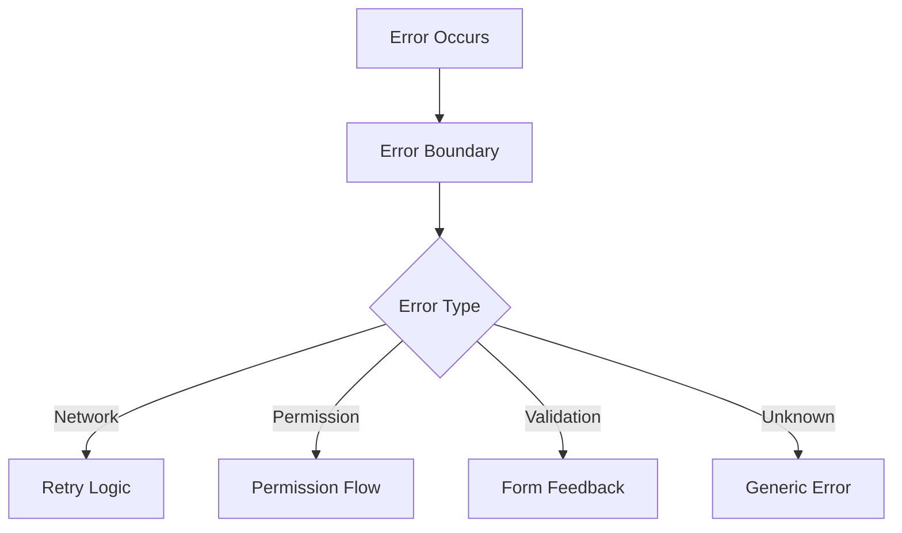
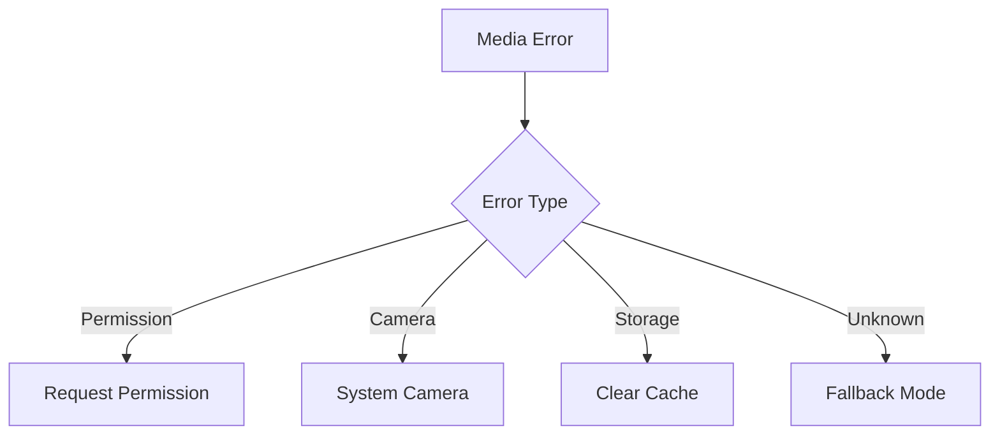
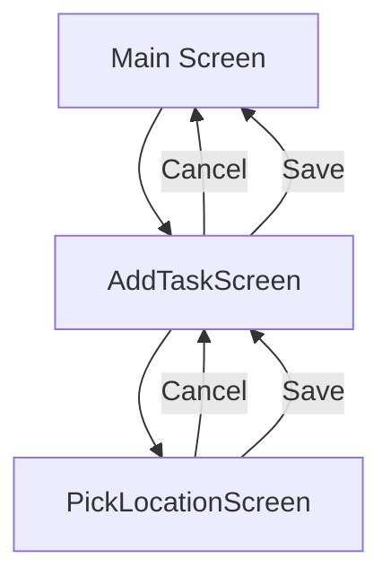
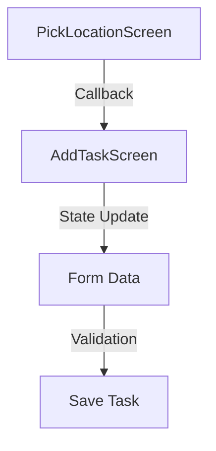
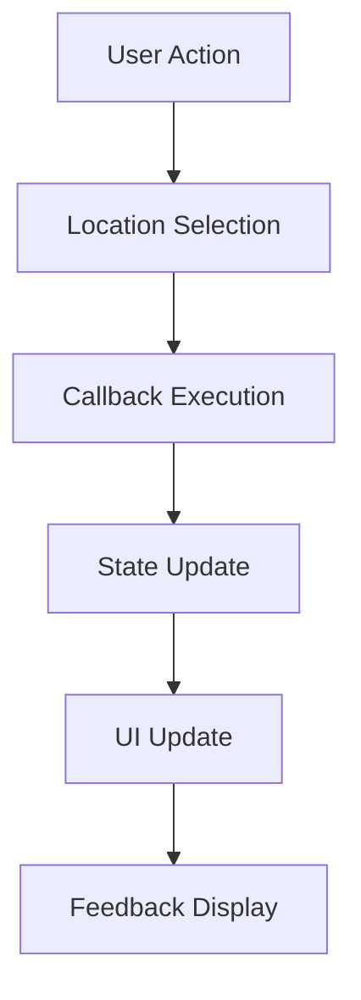
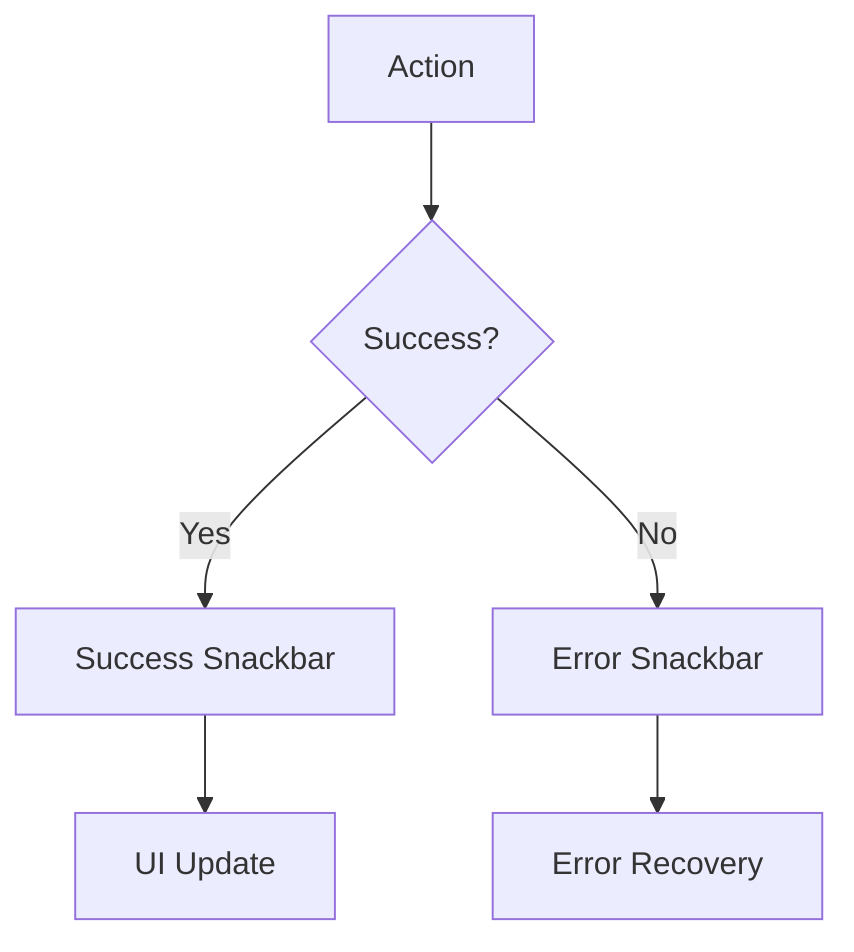
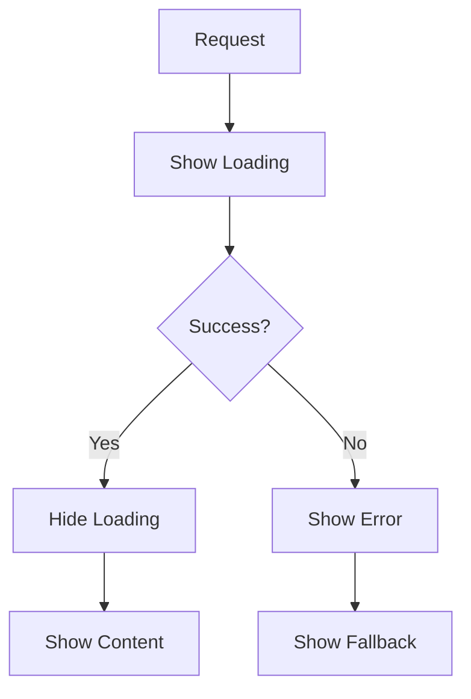
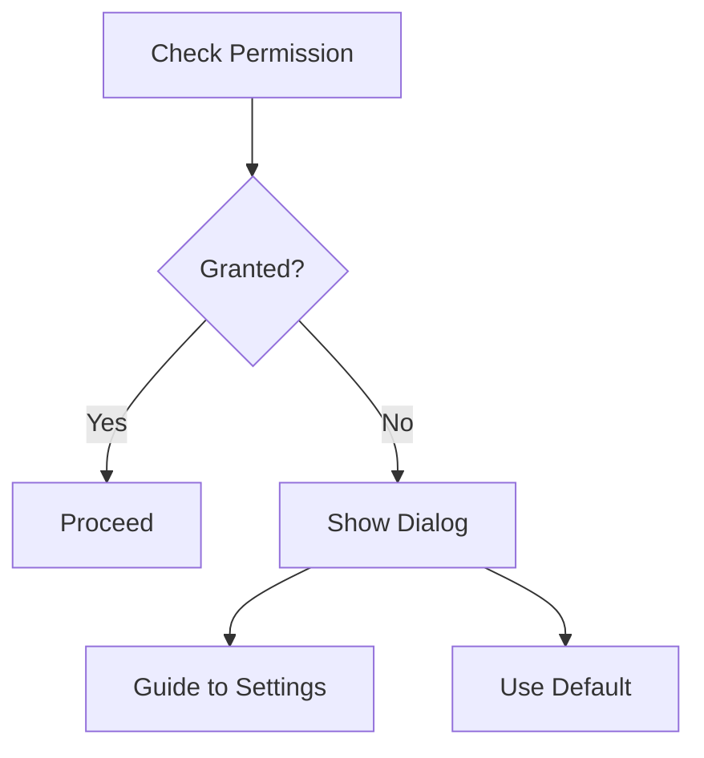
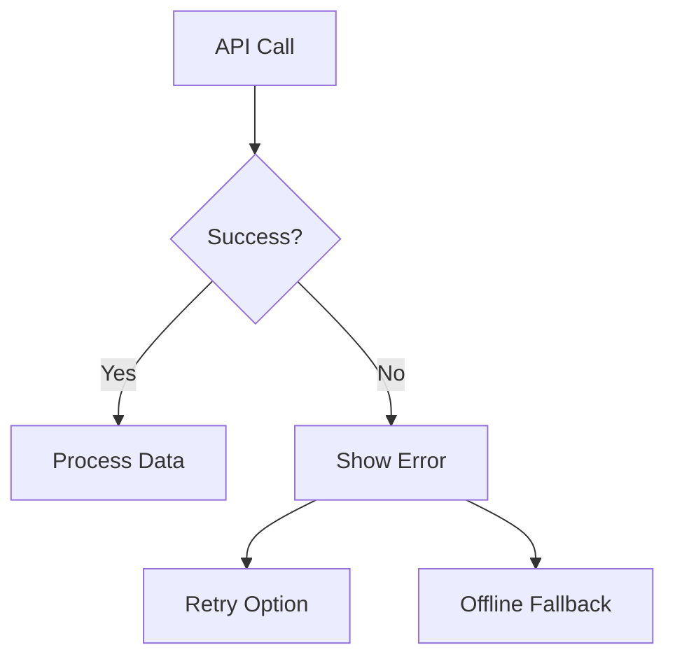

# Pola Sistem TugasKu

## Arsitektur Aplikasi

### 1. Struktur Folder
```
src/
├── components/    # Komponen reusable
├── screens/       # Screen components
├── navigation/    # Navigation setup
├── services/      # Business logic & API
├── context/       # Global state
└── utils/         # Helper functions
```

### 2. Pola Desain

#### Component Patterns
- Functional Components
- Custom Hooks
- Higher Order Components
- Render Props (when needed)
- Component Composition

#### State Management
- Context API untuk global state
- useState untuk local state
- useReducer untuk complex state
- Props untuk component communication

#### Navigation Pattern
- Stack Navigation untuk auth flow
- Tab Navigation untuk main app
- Screen-based routing
- Deep linking support

### 3. Media Handling Pattern

#### Foto Tugas
1. Capture Flow:
   ```mermaid
   graph TD
     A[User Action] --> B[Permission Check]
     B --> C{Permission?}
     C -->|Yes| D[Launch Camera]
     C -->|No| E[Show Permission Dialog]
     D --> F[Take Photo]
     F --> G[Preview & Edit]
     G --> H[Save to Form]
   ```

2. Permission Handling:
   ```mermaid
   graph TD
     A[Check Permission] --> B{Permission Status}
     B -->|Granted| C[Proceed]
     B -->|Denied| D[Show Dialog]
     B -->|Never Ask| E[Guide to Settings]
     D --> F[Request Again]
     F --> B
   ```

3. Image Processing:
   ```mermaid
   graph TD
     A[Capture Image] --> B[Preview]
     B --> C[Edit Options]
     C --> D[Quality Check]
     D --> E[Size Optimization]
     E --> F[Save to State]
   ```

### 4. Form Management Pattern

#### Task Form
1. Data Flow:
   ```mermaid
   graph TD
     A[User Input] --> B[Validation]
     B --> C{Valid?}
     C -->|Yes| D[Update State]
     C -->|No| E[Show Error]
     D --> F[Save/Submit]
   ```

2. Media Integration:
   ```mermaid
   graph TD
     A[Form Data] --> B[Add Photo]
     B --> C[Preview]
     C --> D[Edit/Retake]
     D --> E[Form Submit]
   ```

### 5. Error Handling Pattern

#### Global Error Pattern


#### Media Error Pattern


### 6. Service Pattern

#### API Service
```typescript
class ApiService {
  // Base configuration
  private config: ApiConfig;
  
  // Authentication
  async login(): Promise<AuthResponse>;
  async register(): Promise<AuthResponse>;
  
  // Task Management
  async createTask(task: TaskData): Promise<Task>;
  async uploadPhoto(photo: PhotoData): Promise<string>;
  
  // Error Handling
  private handleError(error: ApiError): void;
}
```

#### Media Service
```typescript
class MediaService {
  // Permission
  async checkPermissions(): Promise<PermissionStatus>;
  async requestPermissions(): Promise<PermissionStatus>;
  
  // Camera
  async capturePhoto(): Promise<PhotoResult>;
  async editPhoto(photo: Photo): Promise<EditedPhoto>;
  
  // Optimization
  async optimizePhoto(photo: Photo): Promise<OptimizedPhoto>;
}
```

## Best Practices

### 1. Component Design
- Single Responsibility
- Reusable Components
- Proper Props Validation
- Error Boundaries
- Loading States

### 2. State Management
- Immutable Updates
- Controlled Components
- Proper Context Usage
- State Normalization
- Performance Optimization

### 3. Error Handling
- Graceful Degradation
- User Feedback
- Error Recovery
- Logging
- Debugging Support

### 4. Media Handling
- Permission Management
- Resource Optimization
- Quality Control
- User Feedback
- Error Recovery

### 5. Performance
- Lazy Loading
- Code Splitting
- Memory Management
- Network Optimization
- Cache Strategy

### 6. Security
- Input Validation
- Data Sanitization
- Secure Storage
- Permission Control
- API Security

## Konvensi Kode

### 1. File Structure
```
src/
├── context/
│   └── AuthContext.js
├── navigation/
│   ├── RootNavigator.js
│   └── AuthNavigator.js
├── screens/
│   ├── auth/
│   │   ├── LoginScreen.js
│   │   └── RegisterScreen.js
│   └── ProfileScreen.js
└── services/
    ├── api/
    │   ├── auth.service.js
    │   └── axios.instance.js
    └── config/
        └── api.config.js
```

### 2. Naming Conventions
- PascalCase untuk komponen
- camelCase untuk fungsi dan variabel
- UPPER_CASE untuk konstanta
- kebab-case untuk file assets

### 3. Error Handling
- Try-catch blocks untuk async operations
- Error messages dalam Bahasa Indonesia
- Centralized error handling di services
- User-friendly error displays

### 4. Development Mode
- Konstanta IS_DEVELOPMENT
- Skip authentication option
- Development indicators
- Simplified API calls 

## Pola Navigasi

### 1. Modal Navigation Pattern


### 2. Data Flow Pattern


### 3. Screen Communication Pattern
```typescript
interface LocationCallback {
  onLocationSelect: (location: {
    latitude: number;
    longitude: number;
  }) => void;
}

interface NavigationParams {
  previousLocation?: {
    latitude: number;
    longitude: number;
  };
  onLocationSelect?: LocationCallback;
}
```

### 4. State Management Pattern


## Pola Feedback

### 1. User Feedback Flow


### 2. Loading State Pattern


## Pola Error Handling

### 1. Permission Error Pattern


### 2. Network Error Pattern


## Best Practices

### 1. Navigation
- Modal presentation untuk picker screens
- Konsisten header styling
- Proper back navigation
- State persistence
- Screen transition animations

### 2. Data Flow
- Callback pattern untuk komunikasi
- Immutable state updates
- Validasi data
- Error handling
- Loading states

### 3. UI/UX
- Consistent button placement
- Visual feedback
- Loading indicators
- Error messages
- Gesture handling

### 4. Performance
- useEffect cleanup
- Proper state management
- Memoization
- Lazy loading
- Event debouncing

### 5. Code Organization
- Feature-based structure
- Shared components
- Type definitions
- Constants
- Utility functions

## Konvensi Implementasi

### 1. Screen Structure
```typescript
interface ScreenProps {
  navigation: NavigationProp;
  route: RouteProp;
}

function Screen({ navigation, route }: ScreenProps) {
  // State management
  const [state, setState] = useState(initialState);

  // Effects
  useEffect(() => {
    // Setup & cleanup
  }, []);

  // Event handlers
  const handleAction = () => {
    // Action logic
  };

  // Render methods
  return (
    <SafeAreaView>
      <Content />
      <Feedback />
    </SafeAreaView>
  );
}
```

### 2. Navigation Configuration
```typescript
const Stack = createStackNavigator();

function Navigator() {
  return (
    <Stack.Navigator>
      <Stack.Group screenOptions={modalOptions}>
        <Stack.Screen name="Screen" component={Screen} />
      </Stack.Group>
    </Stack.Navigator>
  );
}
```

### 3. Error Handling
```typescript
try {
  // Main logic
} catch (error) {
  // Error handling
  showFeedback(error.message);
  logError(error);
  fallback();
}
```

### 4. State Updates
```typescript
const updateState = (newData) => {
  setState(prev => ({
    ...prev,
    ...newData
  }));
  showFeedback('Success');
};
``` 