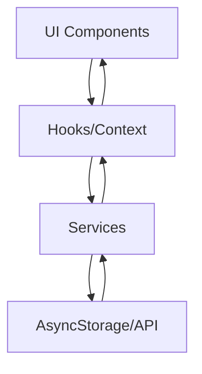

# Pola Sistem TugasKu

## Arsitektur Aplikasi

### 1. Struktur Direktori
```
src/
├── screens/          # Layar utama aplikasi
├── components/       # Komponen reusable
├── navigation/       # Konfigurasi navigasi
├── services/         # Logic bisnis & API
├── hooks/           # Custom React hooks
├── contexts/        # Context providers
├── theme/           # Tema & styling
├── i18n/           # Internasionalisasi
├── utils/           # Fungsi utilitas
└── config/          # Konfigurasi aplikasi
```

### 2. Pola Komponen
- Functional Components dengan Hooks
- Props validation
- Memoization untuk optimasi
- Error boundaries
- Loading states

### 3. State Management
- Local state: useState
- Global state: Context API
- Persistence: AsyncStorage
- Form state: Controlled components

### 4. Data Flow


## Fitur Patterns

### 1. Manajemen Tugas
- CRUD operasi
- Validasi form
- Prioritas tugas
- Status tracking
- Notifikasi

### 2. Timeline & Agenda
- Grouping by date
- Sorting by priority
- Filter capabilities
- Search functionality
- Infinite scroll

### 3. Lokasi & Maps
- Permission handling
- Current location
- Location search
- Map markers
- Distance calculation

### 4. Media Handling
- Image picker
- Camera integration
- File compression
- Cache management
- Upload queue

### 5. Notifikasi
- Push notifications
- Local notifications
- Scheduling
- Badge counting
- Action handlers

## UI/UX Patterns

### 1. Navigation
- Bottom tabs
- Stack navigation
- Modal screens
- Deep linking
- Navigation state

### 2. Forms
- Validation
- Error messages
- Auto-complete
- Date/time pickers
- Location pickers

### 3. Lists & Data Display
- Pull to refresh
- Infinite scroll
- Skeleton loading
- Empty states
- Error states

### 4. Feedback
- Toast messages
- Loading indicators
- Error messages
- Success feedback
- Progress indicators

## Security Patterns

### 1. Data Storage
- Encrypted storage
- Secure preferences
- Token management
- Cache clearing

### 2. API Security
- Authentication
- Authorization
- Token refresh
- Request signing
- Error handling

### 3. Permissions
- Runtime permissions
- Graceful degradation
- Settings redirect
- Permission persistence

## Performance Patterns

### 1. Optimizations
- Image optimization
- Lazy loading
- Memoization
- Debouncing
- Throttling

### 2. Caching
- API response cache
- Image cache
- Location cache
- Form data persistence

### 3. Error Recovery
- Retry mechanisms
- Fallback states
- Offline support
- Data sync 